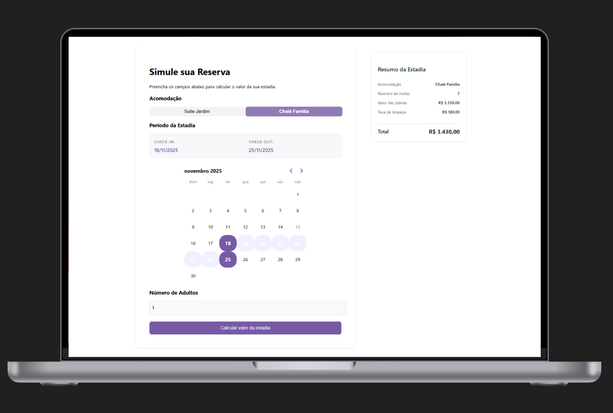

<p align="center">
  <a href="#-site">Site</a>&nbsp;&nbsp;&nbsp;|&nbsp;&nbsp;&nbsp;
  <a href="#-technology">Technology</a>&nbsp;&nbsp;&nbsp;|&nbsp;&nbsp;&nbsp;
  <a href="#-how-to-run">How to run</a>&nbsp;&nbsp;&nbsp;|&nbsp;&nbsp;&nbsp;
  <a href="#-project">Project</a>&nbsp;&nbsp;&nbsp;|&nbsp;&nbsp;&nbsp;
</p>

<br>

<p align="center">
  
</p>

## 🌌 Site

In the link below you will find the complete responsive website.

-   [Calculadora de Tarifário](https://calculadora-tarifario.vercel.app/)

## 🚀 Technology

This project was developed with the following technologies:

-   [React](https://react.dev/)

## ⚙️ How to run

To run this project locally, follow the steps below:

```bash
# Install dependencies
npm install

# Run the development server
npm run start
```

## 💻 Project

This is a dev challenge from Hospedin.